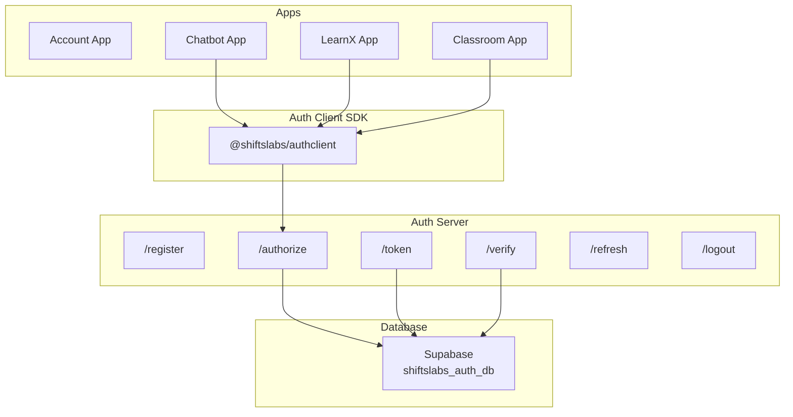

# Shiftslabs Ecosystem Plan

## Project Overview

**Shiftslabs** is a Google rival ecosystem being built with 50+ apps. This plan outlines the core SSO (Single Sign-On) infrastructure that will power all these apps across PWA, APK, and web platforms.

### Core Vision
- One account signs users into ALL apps
- Apps share authentication via a central auth server
- Works across Chrome, Safari (iOS), PWA, and APK
- Educational focus with LearnX and Classroom apps

---

## Architecture Overview



---

## Authentication Flow

### 1. Registration Flow
```
User → /register (POST username, email, password) 
     → Password hashed with PBKDF2
     → User created in Supabase
     → Session created, user logged in
```

### 2. Authorization Flow
```
App → Redirect to /authorize?client_id=APP&redirect_uri=APP_URL
    → Check session
    → If no session → Show login UI
    → If new app → Show consent UI
    → Generate auth_code
    → Redirect to app?code=AUTH_CODE
```

### 3. Token Exchange
```
App → POST /token (code, client_id)
    → Verify auth_code
    → Generate JWT (15 min) + refresh_token (30 days)
    → Return { access_token, refresh_token, user }
```

### 4. Verify Endpoint
```
App → /verify (Authorization: Bearer TOKEN)
    → Verify JWT
    → Return { user: { id, username, avatar } }
```

---

## Cross-Platform Compatibility

| Platform | Method |
|----------|--------|
| Pages.dev subdomains | URL-based handshake with code |
| Safari (iOS) | Full redirect fallback |
| PWA | LocalStorage primary |
| APK | LocalStorage + native storage |

---

## Database Schema (Supabase)

### shiftslabs_auth_db

#### users
- id (UUID, PK)
- username (VARCHAR, UNIQUE)
- email (VARCHAR, UNIQUE)
- avatar_url (TEXT)
- password_hash (TEXT)
- created_at (TIMESTAMP)

#### apps
- id (UUID, PK)
- name (VARCHAR)
- client_id (VARCHAR, UNIQUE)
- redirect_uri (TEXT)
- is_whitelisted (BOOLEAN)
- created_at (TIMESTAMP)

#### user_consents
- id (UUID, PK)
- user_id (UUID, FK)
- app_id (UUID, FK)
- scope (TEXT)
- granted_at (TIMESTAMP)

#### sessions
- id (UUID, PK)
- user_id (UUID, FK)
- refresh_token (VARCHAR, UNIQUE)
- expires_at (TIMESTAMP)
- created_at (TIMESTAMP)

---

## Whitelist vs Non-Whitelist Apps

| App Type | Behavior |
|----------|----------|
| **Whitelisted** | Auto-login, no consent needed |
| **Non-Whitelisted** | Show consent: "App X wants username + avatar" |

---

## App-Specific Databases

- **shiftslabs_chatbot_db**: Chat conversations, preferences
- **shiftslabs_learnx_db**: Courses, lessons, enrollments
- **shiftslabs_classroom_db**: Courses, assignments, submissions

---

## Security Measures

1. **Client Validation**: Verify client_id + redirect_uri match
2. **JWT Verification**: All protected routes verify JWT
3. **Input Sanitization**: Trim, limit length, remove HTML
4. **Rate Limiting**: Prevent brute force attacks
5. **CORS**: Whitelist allowed origins
6. **One-time Codes**: Auth codes expire in 10 minutes
7. **Token Rotation**: Refresh tokens rotate on use

---

## File Structure

```
shiftslabs/
├── package.json              # Root with workspaces
├── turbo.json                
├── .env.example              
│
├── apps/
│   ├── account/              # SSO Hub
│   ├── chatbot/              # AI Chatbot
│   ├── learnx/               # LearnX Education
│   └── classroom/            # Classroom LMS
│
├── packages/
│   ├── auth/                 # @shiftslabs/auth
│   ├── authclient/           # @shiftslabs/authclient
│   └── ui/                   # @shiftslabs/ui
│
└── infra/
    └── db/
        ├── migrations/       # Auth DB migrations
        ├── migrations_chatbot/
        ├── migrations_learnx/
        └── migrations_classroom/
```

---

## Testing Checklist

1. **Registration Flow**: User creates account, password hashed, auto-login
2. **SSO Flow**: Login once, access all apps without re-auth
3. **Token Refresh**: JWT auto-refreshes after 15 min
4. **Logout Flow**: Logout clears all apps
5. **Classroom Flow**: Teacher creates course → Student enrolls → Submit → Grade

---

## Next Steps

1. **Phase 1**: Database Setup - Create Supabase, run migrations
2. **Phase 2**: Auth Server - Build all endpoints
3. **Phase 3**: Auth Client SDK - Create npm package
4. **Phase 4**: Account App - Build login/signup/dashboard
5. **Phase 5**: Satellite Apps - Chatbot, LearnX, Classroom
6. **Phase 6**: Testing - Run full checklist
